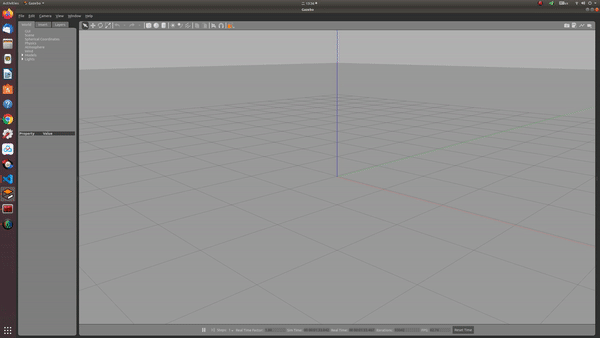
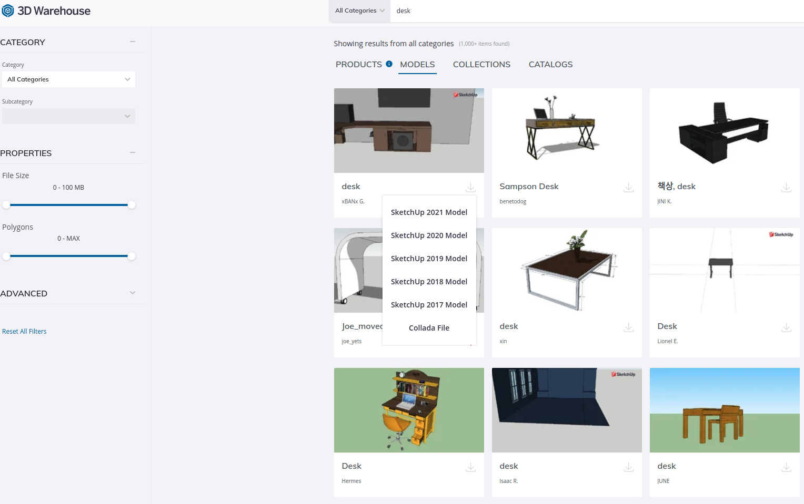
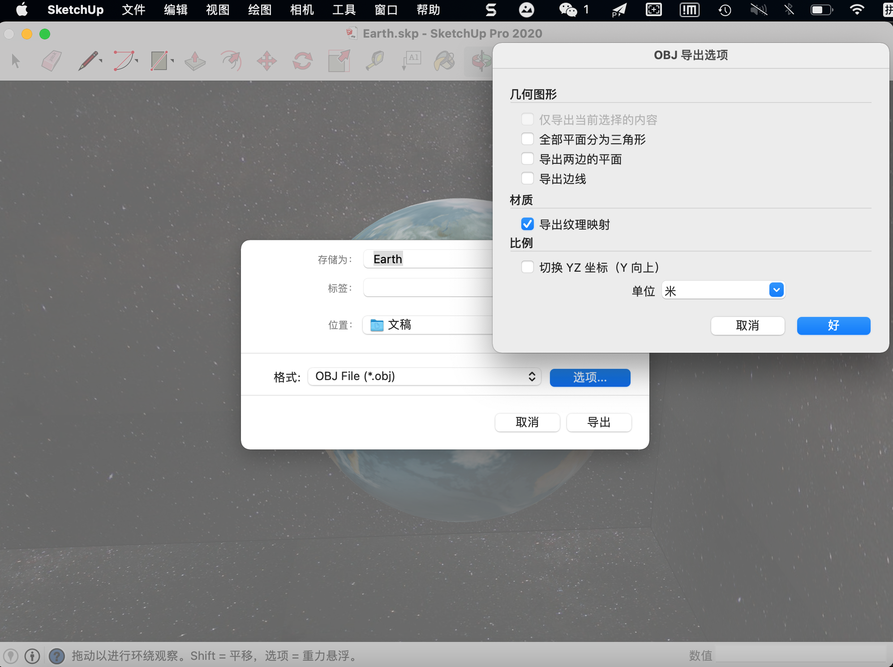

# Gazebo-models-generator
A tools to generate Gazebo models from 3D models.(Sketchup files, *.dae, *.obj, *.stl, etc.)

The scripts will be released soon.

Step 1: Download the data from 3d warehouse.

Step 2: Using sketchup tools to convert *.skp files to *.obj with texture.

Step 3: using scripts convert to gazebo model and copy it to ~/.gazebo/models/

# Gazebo-models-generator

A tools(python scripts) to generate Gazebo models from 3D models.(Sketchup files, *.dae, *.obj, *.stl, etc.).


[![Contributors][contributors-shield]][contributors-url]
[![Forks][forks-shield]][forks-url]
[![Stargazers][stars-shield]][stars-url]
[![Issues][issues-shield]][issues-url]

<!-- PROJECT LOGO -->
<br />
<p align="center">
  <a href="https://github.com/TurtleZhong/Gazebo-models-generator">
    
  </a>

  <h3 align="center">Gazebo-models-generator</h3>

  <p align="center">
    A tools(python scripts) to generate Gazebo models from 3D models.(Sketchup files, *.dae, *.obj, *.stl, etc.).
    <!-- A basic implementation of <a href="https://arxiv.org/abs/2007.01813">AVP-SLAM: Semantic Visual Mapping and Localization for Autonomous Vehicles in the Parking Lot(IROS 2020)</a> in simulation! -->
    <br />
    <a href="https://github.com/TurtleZhong/Gazebo-models-generator">View Demo</a>
    ·
    <a href="https://github.com/TurtleZhong/Gazebo-models-generator/issues">Report Bug</a>
    ·
    <a href="https://github.com/TurtleZhong/Gazebo-models-generator">Request Feature</a>
  </p>
</p>

<!-- TABLE OF CONTENTS -->
<details open="open">
  <summary>Table of Contents</summary>
  <ol>
    <li>
      <a href="#about-the-project">About The Project</a>
    </li>
    <li><a href="#how to run">How to run</a></li>
    <li><a href="#roadmap">Roadmap</a></li>
    <li><a href="#contributing">Contributing</a></li>
    <li><a href="#license">License</a></li>
    <li><a href="#contact">Contact</a></li>
    <li><a href="#acknowledgements">Acknowledgements</a></li>
  </ol>
</details>

<!-- ABOUT THE PROJECT -->
### About The Project
<p align="center">
  <a href="">
    
  </a>
</p>


&emsp;&emsp; This project is provide a scrip to convert 3D models from sketchup and convert it to gazebo models.


### How to run

&emsp;&emsp; This project provide a gazebo world. so if you wanna test the code, you need prepare the simulation world.

&emsp;&emsp; Step 1: you need download sketchup software and install it in your Windows PC or Mac OX, Then choose your favourite models and download the sketchup files.

<p align="center">
  <a href="">
    
  </a>
</p>

&emsp;&emsp; Step 2: Open *.skp files using Sketchup Software and export it in *.obj format, you will get `MODEL_NAME.mtl, MODEL_NAME.obj, MODEL_NAME/` 3 files.
<p align="center">
  <a href="">
    
  </a>
</p>


&emsp;&emsp; Step 3:
```bash
mkdir auto_gen && cd auto_gen
git clone https://github.com/TurtleZhong/Gazebo-models-generator.git
```

```
usage: gazebo_models_generator.py [-h] [--model_type MODEL_TYPE]
                                  [--model_name MODEL_NAME]
                                  [--author_name AUTHOR_NAME]
                                  [--author_email AUTHOR_EMAIL]

optional arguments:
  -h, --help            show this help message and exit
  --model_type MODEL_TYPE
                        The 3d model format(obj,stl,dae)
  --model_name MODEL_NAME
                        The output of the gazebo model name
  --author_name AUTHOR_NAME
                        The output of the Author name
  --author_email AUTHOR_EMAIL
                        The output of the author email
```

&emsp;&emsp; Put the output of sketchup software, and put them in the `input/` folder, eg Earth

```bash
.
├── gazebo_models_generator.py
├── images
│   ├── earth_sketchup.gif
│   └── model_to_gazebo.gif
├── input
│   ├── Earth
│   ├── Earth.mtl
│   └── Earth.obj
├── LICENSE
├── output
│   └── models
├── README.md
└── sample
    ├── meshes
    ├── model.config
    ├── model.sdf
    └── test.xml
```

&emsp;&emsp;We only support *.obj format.
```bash
cd Gazebo-models-generator/
python3 gazebo_models_generator.py --model_name=Earth
```

```bash
python3 gazebo_models_generator.py --model_name=YOUR_MODEL_NAME
```

`YOUR_MODEL_NAME must be the same with your sketchup export name!!!`

&emsp;&emsp; The script will automacticly gen gazebo models in `output/models/MODEL_NAME`, copy it to the ~/.gazebo/models/
```bash
cp -r output/models/MODEL_NAME ~/.gazebo/models/
```


If everything is OK, you will get this:
<p align="center">
  <a href="">
    
  </a>
</p>


<!-- ROADMAP -->
### Roadmap

* [Gazebo]()
* [simulation environment]()
* [......]()


<!-- CONTRIBUTING -->
### Contributing

Contributions are what make the open source community such an amazing place to be learn, inspire, and create. Any contributions you make are **greatly appreciated**.

1. Fork the Project
2. Create your Feature Branch (`git checkout -b feature/AmazingFeature`)
3. Commit your Changes (`git commit -m 'Add some AmazingFeature'`)
4. Push to the Branch (`git push origin feature/AmazingFeature`)
5. Open a Pull Request


<!-- LICENSE -->
### License

Distributed under the MIT License.


<!-- CONTACT -->
### Contact

Xinliang Zhong - [@zxl](null) - xinliangzhong@foxmail.com


Project Link: [https://github.com/TurtleZhong/Gazebo-models-generator](https://github.com/TurtleZhong/Gazebo-models-generator)


<!-- ACKNOWLEDGEMENTS -->
### Acknowledgements
* [ROS](http://wiki.ros.org/)
* [Gazebo](http://gazebosim.org/)


<!-- MARKDOWN LINKS & IMAGES -->
<!-- https://www.markdownguide.org/basic-syntax/#reference-style-links -->
[contributors-shield]: https://img.shields.io/github/contributors/TurtleZhong/Gazebo-models-generator.svg?style=for-the-badge
[contributors-url]: https://github.com/TurtleZhong/Gazebo-models-generator/graphs/contributors
[forks-shield]: https://img.shields.io/github/forks/TurtleZhong/Gazebo-models-generator.svg?style=for-the-badge
[forks-url]: https://github.com/TurtleZhong/Gazebo-models-generator/network/members
[stars-shield]: https://img.shields.io/github/stars/TurtleZhong/Gazebo-models-generator.svg?style=for-the-badge
[stars-url]: https://github.com/TurtleZhong/Gazebo-models-generator/stargazers
[issues-shield]: https://img.shields.io/github/issues/TurtleZhong/Gazebo-models-generator.svg?style=for-the-badge
[issues-url]: https://github.com/TurtleZhong/Gazebo-models-generator/issues
[license-shield]: https://img.shields.io/github/license/TurtleZhong/Gazebo-models-generator.svg?style=for-the-badge
[license-url]: https://github.com/TurtleZhong/Gazebo-models-generator/blob/master/LICENSE.txt
[linkedin-shield]: https://img.shields.io/badge/-LinkedIn-black.svg?style=for-the-badge&logo=linkedin&colorB=555
[linkedin-url]: https://linkedin.com/in/TurtleZhong


